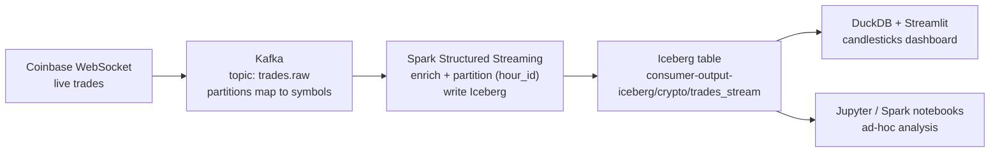
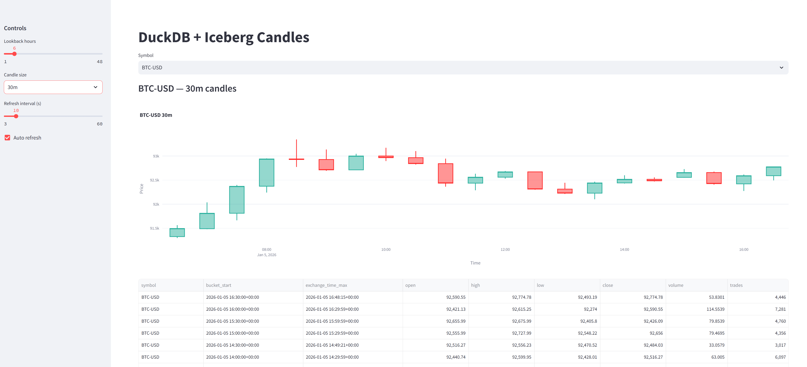

# Kafka Crypto Streaming

## Objective
Stream live Coinbase trades into Kafka, process with Spark Structured Streaming, land them in Iceberg, and visualize in the Streamlit + DuckDB dashboard. 

Dashboard ensure maximum delay of 10-15 seconds compare to real-time data

**Live pipeline:**  
**Coinbase → Kafka → Spark → Iceberg → DuckDB/Streamlit**

---

## Architecture
- **Producer (Coinbase)** → publishes live trades to Kafka (`trades.raw`).
- **Kafka broker** → partitions mapped 1:1 to product IDs.
- **Spark Structured Streaming consumer** → reads Kafka, enriches timestamps/partition keys, writes to Iceberg (`consumer-output-iceberg/crypto/trades_stream`).
- **DuckDB + Streamlit dashboard** → queries Iceberg via DuckDB and renders candlestick + table.
- **Jupyter/Spark notebooks** → ad-hoc exploration on the same Iceberg data.



---

## Quick Start (Docker)

### 1. Start services
```bash
docker compose up -d
```

### 2. ⚠️ REQUIRED: Create Kafka topic (DO NOT SKIP)
You must create the Kafka topic manually before running the producer or Spark streaming job. If the topic does not exist, the services will not run.

Create topic from host:
```bash
./kafka_create_topic.sh
```

Or inside the Kafka container:
```bash
docker exec -it kafka bash -c "kafka-topics --bootstrap-server localhost:9092 \
 --create --topic trades.raw --partitions 5 --replication-factor 1"
```

If the topic is not created, the pipeline will fail. After creating the topic, restarting containers is safe and expected.

**Important Kafka notes**
- The number of Kafka partitions must match the number of `PRODUCT_IDS` in `producer-crypto-price/.env`.
- Each `product_id` is mapped to one Kafka partition.
- Partition mismatch will result in producer errors such as:
```text
KafkaError{code=_UNKNOWN_PARTITION}
```

---


## JupyterLab (On-demand analysis)
JupyterLab is available at: http://localhost:8888
The kernel is pre-configured with Apache Spark, Spark SQL, and Delta Lake for interactive analysis.

---

## Useful paths
- Streamlit dashboard app code: `streamlit-duckdb-dashboard/app/`
- Iceberg output: `consumer-output-iceberg/crypto/trades_stream/`
- Notebooks: `consumer-jupyter-spark/notebooks/`

---

## Dashboard
- Service: `streamlit-duckdb` (queries Iceberg via DuckDB)
- Default port: `8501` (exposed in Dockerfile; proxy or tunnel as needed)
- Live candlesticks + table for a selected symbol/candle size



---

## Optimizations
- Iceberg over Delta for streaming writes (lower write latency, append-friendly).
- Hourly partitioning (`hour_id`) with partition pruning in readers to cut scan size.
- DuckDB + Iceberg extension for fast reads without Spark overhead (Streamlit dashboard).
- File compaction thread (`rewrite_iceberg_files`) to binpack small files for faster reads.
- Metadata cleanup thread to prune old manifests/metadata and save disk.
- Kafka offsets + checkpointing for reliable recovery of streaming and batch consumption.
- JupyterLab with an active Spark session for quick ad-hoc debugging on the same data.

---

## Networking notes
- Use `kafka:9092` when accessing Kafka from containers.
- Use `localhost:29092` when accessing Kafka from host.
- On Windows, run Kafka scripts using WSL / Git Bash or directly inside the Kafka container.

